## solving linear eq system

### non-singular
- determinant != 0 
- 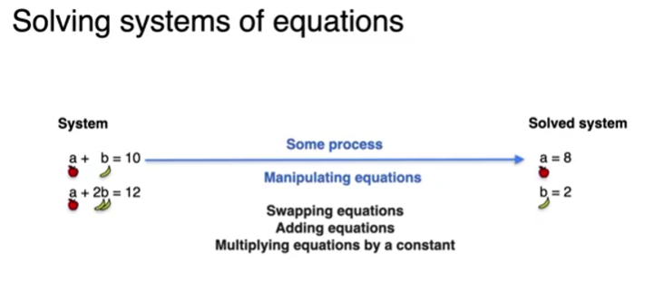

### singular
- determinant = 0
#### redundant systems: 

- anthing u do to the equation 1 affects the equation 2 as they're drived from weach other, so any manipulation will not lead to any change, will always give us 0 = 0 
  
#### contradictory systems: 
- each equation contradicts the others, so we got similar vars yet different results from em, so when we apply mathematical trans upon them we get contradiction nums, like 0 = 2

### solving +2 vars systems of equations:
- elimination method:
  - 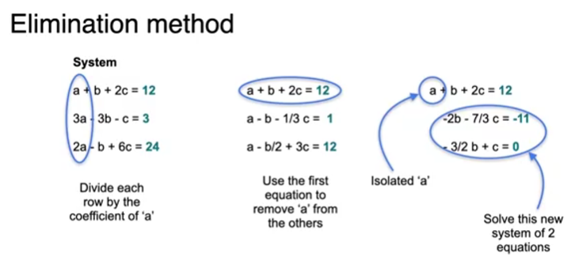


### matrix row reduction
- basically representing elimination but in matrices
  - 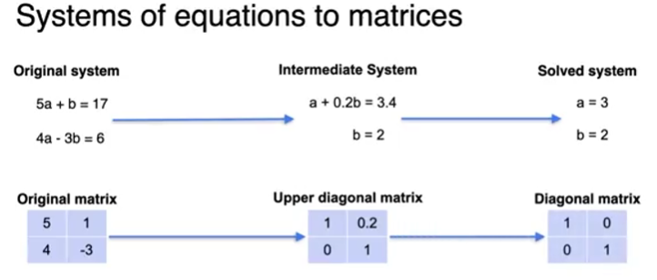

#### row echelon form
``` zero rows are at the bottom, and the leading entry (the first non-zero number) in each non-zero row is to the right of the leading entry in the row above it``` 

##### preserving singularity
  - 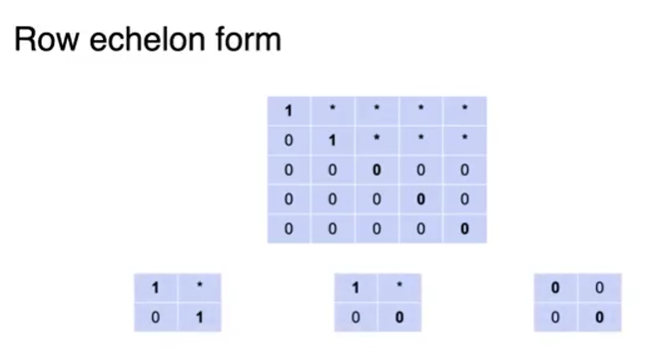
  - it preserves singularity, doesn't affect it, just changes the determinent's sign or so.
  - we could change order of rows => -det
  - mult by scalar(non-zero) => det*scalar
  - add rows => det

##### echelon & rank
1. compressing image: reducing rank
   1. rank depend on num of info the system holds
   2. 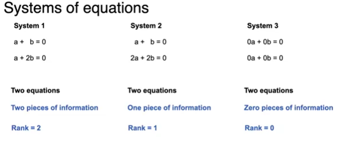
   3. 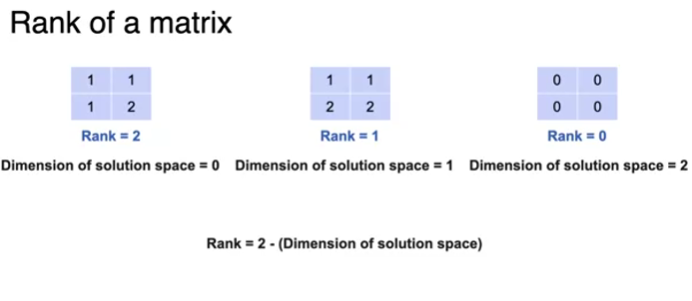
   4. 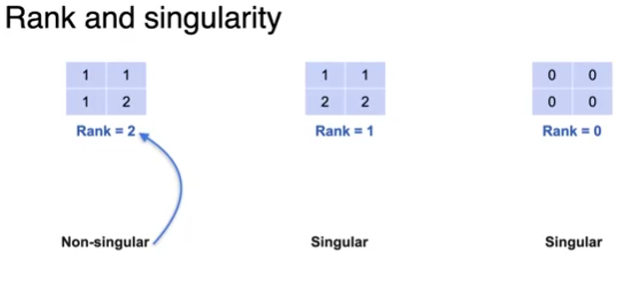
   5. 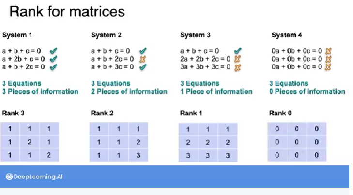
   6. 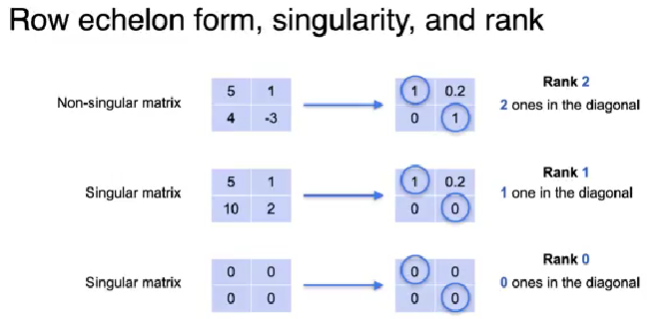
   7. 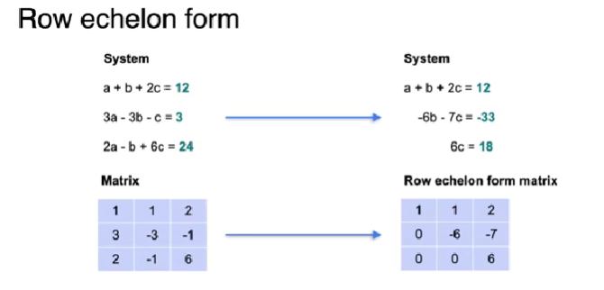
   8. 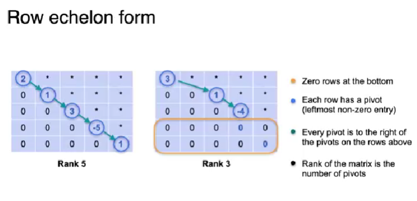
   9. 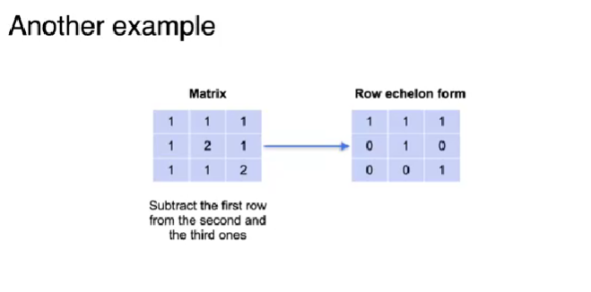
   10. rank of matrices: diagonal ones, most left after the prev 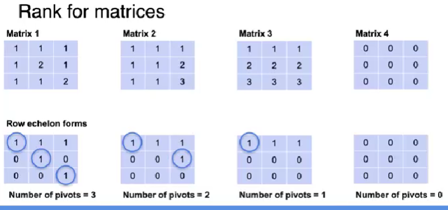
   

### gaussian elimination algorithm
- augmented matrix => use ti solve our sys of equations => elimination method
- set pivotes to one, rest to zeros
- 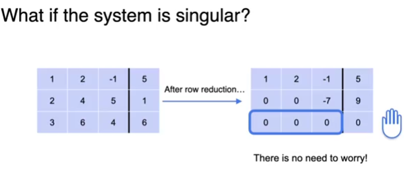
  - butttt, we don't know if it's no solutions or infinity
  - 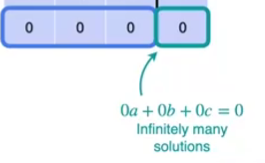
  - 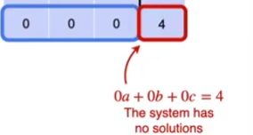
  - 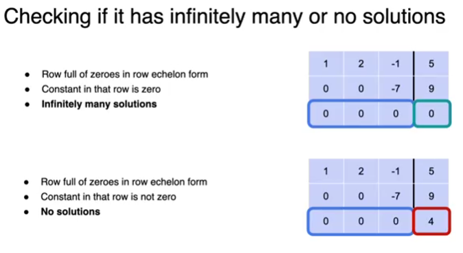
  


  


