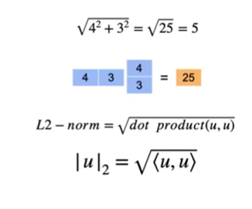
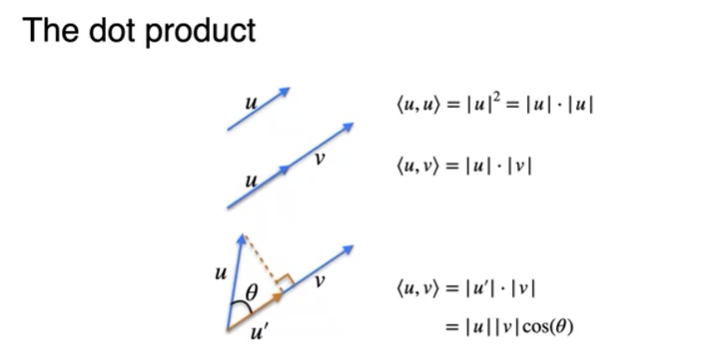
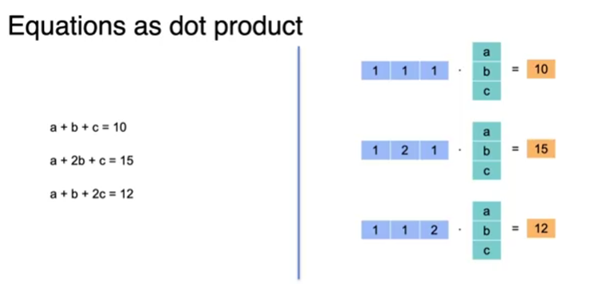
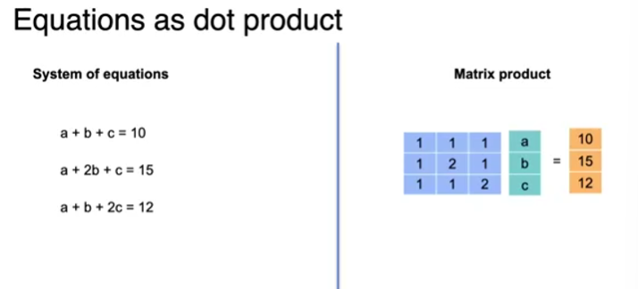
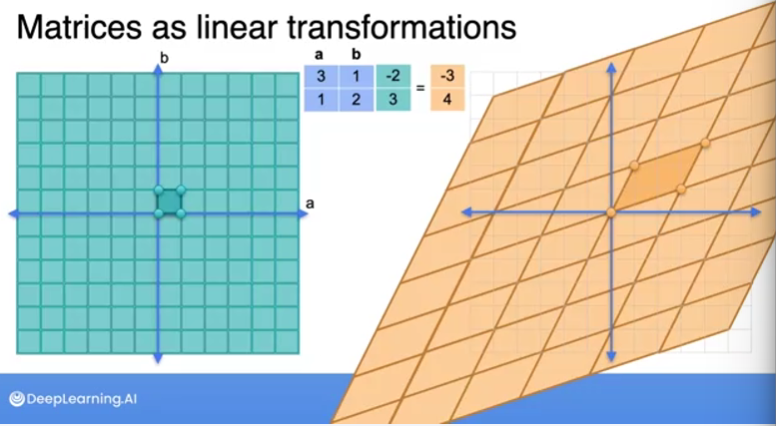
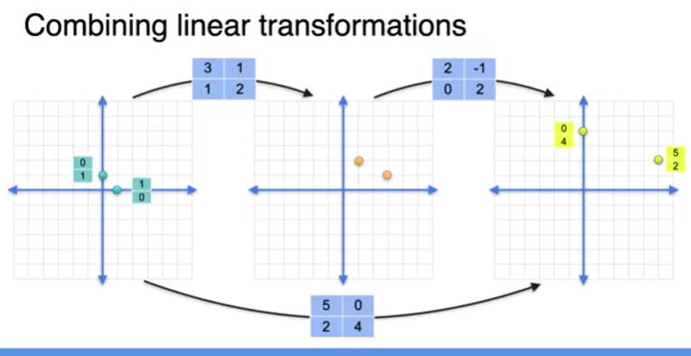

### vectors
#### dot product
- 
- 
- 
- 

#### linear transformation
- 
- 
- combining 2 linear transformations
- linear transformation => change of co-ordinates

#### matrix inverse
- -(1/det)*[mat ^-2]
- invertable matrices have tb non-singular => det != 0 
