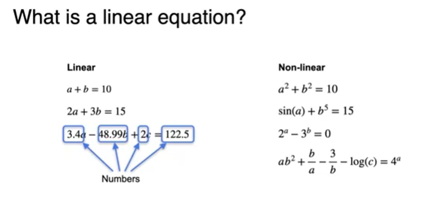
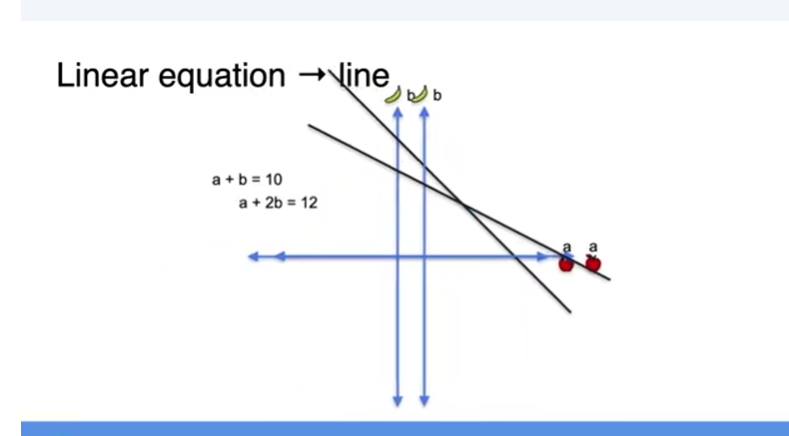
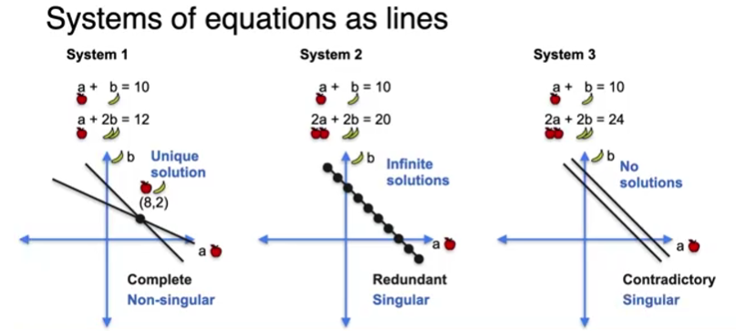
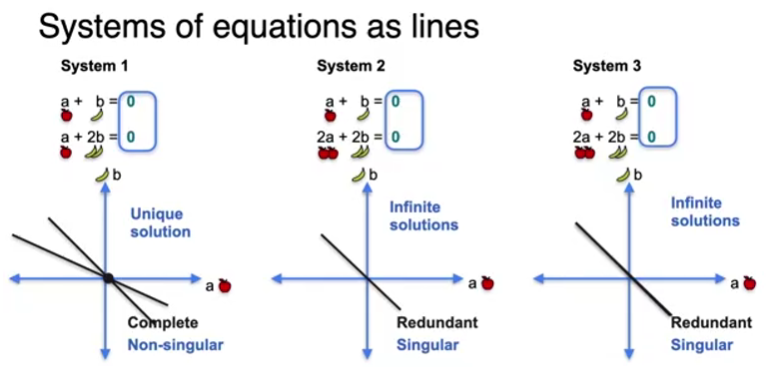
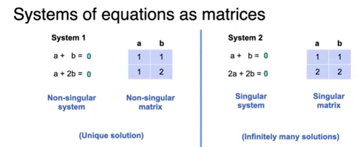
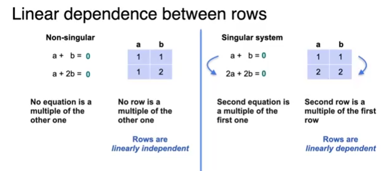

## systems of sentences 
### types of systems:
- Non-Singular:
  1. complete: non repetitive, non antinonm
- Singular:
  1. redundant: repetitive info
  2. contradictory: diff valuse for same obj

## systems of equations:
- systems of equations can have same characteristics as systems of sentences, could be singular & redundant, contradictory, etc.
- systems can simply have no solution!
- 

- 

## lines and plans
- system of 2 lines => has uniques solution where they intersect
- 
- 
  

## singularity
- doesn't depend on constants, we would still determine if a sys is sing. or not wo constanrs
- that's why we'll be working w zero constants from now on.
- 

## systems of equations as matrices
- pour the co-offecients into a matrix
- 

### linear dependency
- linearily dependent: can be derived from one another -> 2nd row is some mult of the 1st row
- 
- in larger systems of matrices, rows linearily depend on each other => singular
- if they ain't depending => non singular

### the determinant
- matrix is singular => if r1 = K * r2
- determinant K = ad - bc == 0? singular

